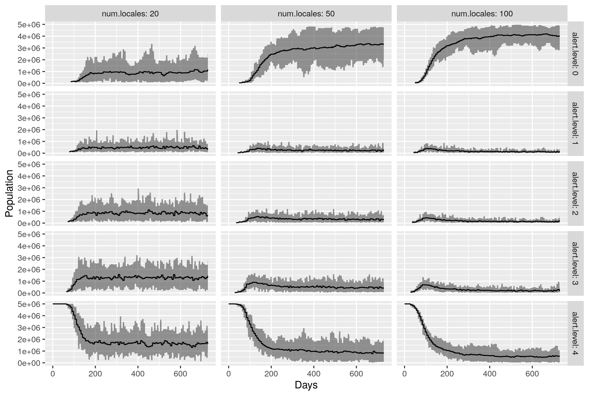
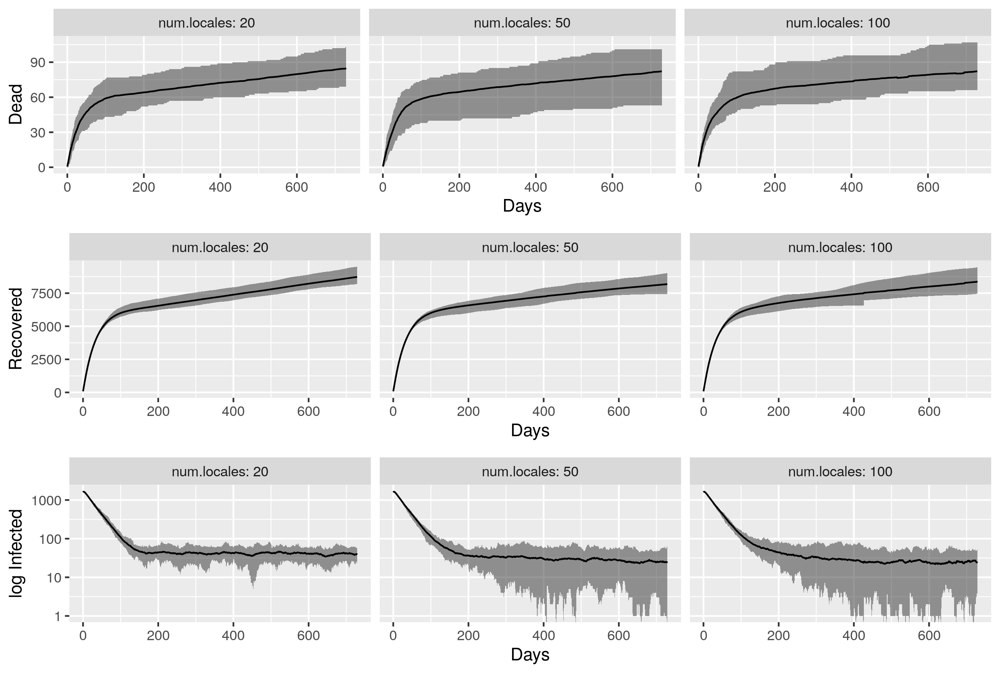

# spatial-epi
A collection of models in [Netlogo](tree/master/) along with other bits and pieces for thinking through how to do spatial epidemic spread modelling.

## Distributed stochastic branching model
The model below is a reimplementation of the stochastic [branching process](https://en.wikipedia.org/wiki/Branching_process) model by Plank et al. described [here](https://www.tepunahamatatini.ac.nz/2020/04/09/a-stochastic-model-for-covid-19-spread-and-the-effects-of-alert-level-4-in-aotearoa-new-zealand/), insofar as is possible given the limitations of that description and lack of access to detailed New Zealand cases and arrivals data prior to lockdown.
+ [`nz-dhb-branching-beta-0-12.nlogo`](models/nz-dhb-branching-beta-0-12.nlogo?raw=true) Click [this link](http://southosullivan.com/misc/nz-dhb-branching-beta-0-12.html) for the web version.

## Distributed SEIR models
These models have interconnected local [SEIR models](https://en.wikipedia.org/wiki/Compartmental_models_in_epidemiology). More specifically these have been coded to with most of the parameters reported for the [Te Pūnaha Matatini SEIR model for COVID-19 in New Zealand, as described here](https://www.tepunahamatatini.ac.nz/2020/03/26/suppression-and-mitigation-strategies-for-control-of-covid-19-in-new-zealand/), although results are unlikely to match exactly given the entirely different platform used, the rapidly evolving situation, and the limitations of verbal descriptions (with or without equations) as a way to unambiguously describe computational models.

The major change from the TPM model is that compartment model runs in individual regions (called 'locales' in the model) linked by a network of connections that mean that depending on travel restrictions that might be imposed or not, disease may reemerge in locales previously cleared. A focal interest is in how different sized regionalisation might allow quarantine levels to be relaxed more or less quickly without compromising measures of success in controlling the epidemic.
+ [`distributed-seir-08.nlogo`](models/distributed-seir-08.nlogo?raw=true). Click [this link](http://southosullivan.com/misc/distributed-seir-08-web.html) for a web version.

A version that can also be initialised with NZ DHB data:
+ [`nz-dhb-seir-08.nlogo`](models/nz-dhb-seir-08.nlogo?raw=true). Click [this link](http://southosullivan.com/misc/nz-dhb-seir-08-web.html) for the web version.

And with NZ Territorial Authority data:
+ [`nz-ta-seir-08.nlogo`](models/nz-ta-seir-08.nlogo?raw=true). Click [this link](http://southosullivan.com/misc/nz-ta-seir-08-web.html) for the web version.

A preliminary result from this model is shown below, suggesting that similar levels of control over spread could potentially be maintained while returning more of the population to low or no quarantine restrictions if quarantine is managed more locally (i.e. using a finer grained regional map.) These results are based not on the actual population map, but on randomly generated abstract spaces with uneven population distributions as would be expected across a range of urban and rural settings.
#### Population in different lockdown levels by number of locales

#### Epidemic results by number of locales

## Earlier versions of the distributed SEIR model
These have been 'frozen' for reference purposes and because 'releases' aren't really appropriate to this project. Brief details as follows. You can find these in the [models](models) folder:
+ `distributed-seir-07.nlogo` as previous but with automatic control of lockdown levels according to a variety of strategies
+ `distributed-seir-06.nlogo` as previous but with correction to locale sizes to match total population more closely
+ `distributed-seir-05.nlogo` fixed lockdown levels and testing added
+ `distributed-seir-04.nlogo` reverts back to the main sequence and allows for locales to vary in size and variance, under paramterisable control

Three even earlier versions have excessive mortality, which has been corrected in later models. The later models are more worth spending time with.
+ `distributed-seir-03.nlogo` is an attempt to enable the model to read in real health management zones. It works, but requires some idiosyncratic code for the file reading.
+ `distributed-seir-02.nlogo` has more spatially coherent connections among the same
+ `distributed-seir.nlogo` has random connections among a set of equal-sized locales

## Experimental
For completeness these two explorations of social isolation 'bubbles' and 'leakage' between them
+ [`bubbles.nlogo`](http://southosullivan.com/misc/bubbles.html)
+ [`nested-bubbles.nlogo`](http://southosullivan.com/misc/nested-bubbles.html)

### Web versions
You can make a web version of any of these by uploading the `.nlogo` file to [http://netlogoweb.org/](http://netlogoweb.org/launch#Load). Some models include `file-` commands not supported by Netlogo Web and will not work.
