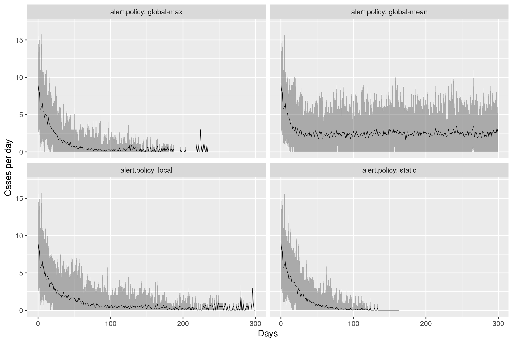

# spatial-epi
A collection of models in [Netlogo](tree/master/) along with other bits and pieces for thinking through how to do spatial epidemic spread modelling, in a time of COVID.

Three sets of models are available here as detailed below.

**Note that the two epidemic models below produce different results**. We believe this is also true of the two models from which they are derived. These models produce results that appear to match well with those of the models on which they are based.

The [distributed stochastic branching model](#distibuted-stochastic-branching-model) and [distributed SEIR model](#distributed-seir-models) have been published as

O’Sullivan D, M Gahegan, DJ Exeter, and B Adams. 2020 (online first). [Spatially explicit models for exploring COVID 19 lockdown strategies](https://dx.doi.org/10.1111/tgis.12660). Transactions in GIS doi: 10.1111/tgis.12660

## Distributed stochastic branching model
This model is a **spatially distributed** (i.e. regionalised) reimplementation of the stochastic [branching process](https://en.wikipedia.org/wiki/Branching_process) model described in

Plank, M. J., R. N. Binny, S. C. Hendy, A. Lustig, and A. James. 2020. [A stochastic model for COVID-19 spread and the effects of Alert Level 4 in Aotearoa New Zealand](https://www.tepunahamatatini.ac.nz/2020/04/09/a-stochastic-model-for-covid-19-spread-and-the-effects-of-alert-level-4-in-aotearoa-new-zealand/).

insofar as is possible given the limitations of that description and lack of access to detailed New Zealand cases and arrivals data prior to lockdown.

+ [Distributed branching process model](models/distributed-branching-process-RC-logging.nlogo?raw=true) Click [this link](http://southosullivan.com/misc/distributed-branching-process-RC-web.html) for the web version.

There is a fair amount of detail on the workings of the model in the **Model Info** tab, and detailed code comments throughout.

The core operation of this model is based on maintaining a time-sorted list of new exposure-time, parent-case pairs. Each model time step, the exposures on this list scheduled to occur that day are drawn, causing a new case to be instantiated. During case initialisation the exposures that will arise from this new case are created and inserted in the exposures list in time-stamp order. The number of new cases added to the list is given by a random draw from the Poisson distribution Pois(*R*0). The time to exposure of those cases is drawn from a Weibull distribution as detailed in the Plank et al. paper. When a new exposure is drawn from the list, it *might not occur* dependent on prevailing lockdown conditions at the time, and also on whether or not the case causing it has been isolated due to contact tracing.

Because the model is spatially explicit, new cases may arise in the same locale or with low probability in a connected other location. Because the parent-case of each case during a model run is known, it is possible to assemble clusters of infection chains and display these in the model.

### Example results
**Note the results discussed in this section may not be the same as those presented in any related published work (or even in the folders on this repo). These are just presented to give an indication of interesting aspects of system bahaviour that can be explored with a model of this kind.**

The desktop version of the model, which runs in the [Netlogo desktop app](http://ccl.northwestern.edu/netlogo/) can log results for locales and cases over time during a model run for subsequent analysis.

#### Population in different lockdown levels by number of locales
The plot below shows time series evolution of total population living under different lockdown levels under local management of lockdown levels, for 30 random runs of the model on randomly generated landscapes with 20, 50, or 100 locales. In all cases total population is 5,000,000 with a skew distribution of locale populations. Results suggest&mdash;as we might intuit&mdash;that finer grained management leads more quickly to a return to normality (it still takes a long time!).  

The ability to lift lockdown more quickly is not accompanied by any loss in control of the epidemic (in fact the opposite is true).

Of course management, enforcement, and political acceptance of highly localised lockdowns might prove highly challenging, whatever the potential advantages might be!

#### Varying alert level policies
Different policies for varying alert levels in the model are provided:
+ **static** no change in alert level
+ **global-mean** all locales change alert levels together based on trigger levels of positive testing for disease averaged across the whole system. This policy tends to be too lax because locales that should be in more severe lockdown are not due to others where disease prevalence is low.
+ **global-max** all locales change alert levels together in response to the highest local rate of positive tests. This is a more conservative approach, which leads to good control of the epidemic but maintains highly restrictive lockdowns for long periods.
+ **local** the alert level of each locale is changed in accordance with the positive test rate in that locale. Different locales may be in different in lockdown levels as a consequence.

The effect of these on cases per day in New Zealand, initialising the model from April 15 Ministry of Health case data is shown below.

30 random runs of each policy with black line showing mean number across runs, and grey area maximum and minimum values.

The corresponding evolution of total population living under various levels of lockdown is shown below, suggesting that managing lockdown locally might lead to large numbers of people living under less restrictive lockdowns more rapidly.

## Distributed SEIR models
These earlier models are **spatially explicit** (i.e. regionalised) [SEIR models](https://en.wikipedia.org/wiki/Compartmental_models_in_epidemiology). More specifically these have been coded to broadly match most of the parameters reported for the [Te Pūnaha Matatini SEIR model for COVID-19 in New Zealand, as described here](https://www.tepunahamatatini.ac.nz/2020/03/26/suppression-and-mitigation-strategies-for-control-of-covid-19-in-new-zealand/), although results are unlikely to match exactly given the entirely different platform used, the rapidly evolving situation, and the limitations of verbal descriptions (with or without equations) as a way to unambiguously describe computational models.

The major change from the TPM model is that compartment model runs in individual regions (called 'locales' in the model) linked by a network of connections that mean that depending on travel restrictions that might be imposed or not, disease may reemerge in locales previously cleared.

These models are more appropriate than the branching process model for handling potentially much more serious outbreaks (branching process models are favoured in the early stages of an epidemic when cases remain rare, something which thankfully continues to be true in New Zealand, at the time of writing.)

+ [Distributed SEIR model](models/distributed-seir-RC-logging.nlogo?raw=true). Click [this link](http://southosullivan.com/misc/distributed-seir-RC-web.html) for a web version.

Results from this model qualitatively similar to those shown above for the branching process model have been observed.

#### Earlier versions of the distributed SEIR model
These have been 'frozen' for reference purposes and because 'releases' aren't really appropriate to this project. Brief details as follows. You can find these in the [models](models) folder:
+ `distributed-seir-07.nlogo` as previous but with automatic control of lockdown levels according to a variety of strategies
+ `distributed-seir-06.nlogo` as previous but with correction to locale sizes to match total population more closely
+ `distributed-seir-05.nlogo` fixed lockdown levels and testing added
+ `distributed-seir-04.nlogo` reverts back to the main sequence and allows for locales to vary in size and variance, under parameterisable control

Three even earlier versions have excessive mortality, which has been corrected in later models. The later models are more worth spending time with.
+ `distributed-seir-03.nlogo` is an attempt to enable the model to read in real health management zones. It works, but requires some idiosyncratic code for the file reading.
+ `distributed-seir-02.nlogo` has more spatially coherent connections among the same
+ `distributed-seir.nlogo` has random connections among a set of equal-sized locales

## Experimental
For completeness two explorations of social isolation 'bubbles' and 'leakage' between them:
+ [`bubbles.nlogo`](http://southosullivan.com/misc/bubbles.html)
+ [`nested-bubbles.nlogo`](http://southosullivan.com/misc/nested-bubbles.html)

and a (highly preliminary) look at contact tracing
+ [`contact-tracing.nlogo`](http://southosullivan.com/misc/contact-tracing.html)

### Web versions
You can make a web version of any of these by uploading the `.nlogo` file to [http://netlogoweb.org/](http://netlogoweb.org/launch#Load). Some models include `file-` commands not supported by Netlogo Web and will not work.
